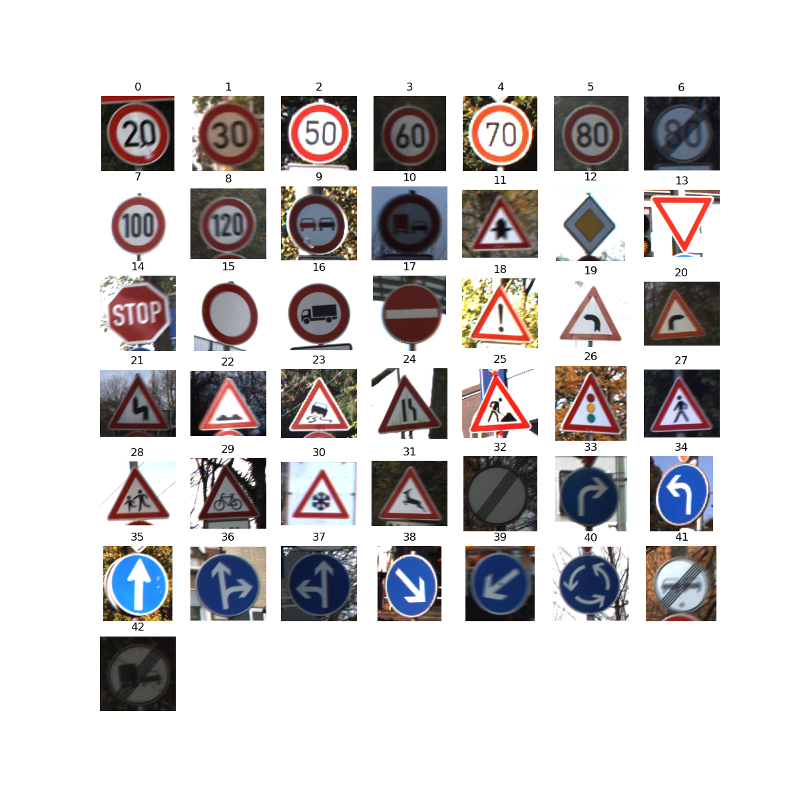

# Conceptual Learning and Causal Reasoning for Semantic Communication

(Description of the project here)

The project experimental results can be recreated using the code in this repository. Steps for carrying out the experiments are detailed below. Note that all experiments were performed on a Linux machine running Ubuntu 22.04.

## Environment Setup

> *Note*: if planning to train the model on a GPU with CUDA, be sure all required software is installed before setting up the environment. See the documented software requirements [here](https://www.tensorflow.org/install/pip#software_requirements).

An Anaconda environment was created to carry out the experiments. This environment can be created using the file `env/setup.yaml`. First, be sure to [install Anaconda](https://docs.anaconda.com/anaconda/install/). Then open a terminal and navigate to the `env/` subdirectory in this repository and run the command:

```bash
conda env create -f setup.yaml
```

Once the environment has been created, to activate it run the command:

```bash
conda activate sccsr-env
```

> *Note*: newer versions of Tensorflow/Keras (versions 2.16.1/3.3.2, respectfully, at the time of writing) seem to have trouble finding the CUDA libraries for training on a GPU. One workaround is to use the method described in [this comment](https://github.com/tensorflow/tensorflow/issues/63362#issuecomment-1988630226) on GitHub.

## Steps

The project experiments consist of six primary steps:

1. Prepare the data
2. Learn the domains using the CSLearn package
3. Carry out the causal learning workflow
4. Train the semantic decoder
5. Prepare baseline models
6. Perform wireless simulations

### 1. Prepare the data

This project uses the German traffic sign dataset [1]. The original dataset can be downloaded [here](https://sid.erda.dk/public/archives/daaeac0d7ce1152aea9b61d9f1e19370/published-archive.html). For this project, the following files are used:

- GTSRB_Final_Training_Images.zip (Training data)
- GTSRB_Final_Test_Images.zip (Test data)
- GTSRB_Final_Test_GT.zip (Test data labels)

Examples with the corresponding labels are shown below.



#### Obtain the raw data

To get the data ready for use by the preparation script, navigate to the `local/` subdirectory in this repository and run the following commands:

```bash
chmod u+x get_raw_data.sh
./get_raw_data.sh
```

This bash script downloads the data, extracts the raw data from the `.zip` files and places them into the correct subdirectories.

#### Prepare the raw data

To use the raw data for learning the domains, the raw images are packaged into memory-mapped Numpy arrays. To do this, in the main directory run the script `1_1_create_memmap_arrays.py`. This script will create the arrays and save them to `local/memmap_data/`.

> *Note*: the original data is split into three datasets. The original training images (39209 images) are used for learning the domains. The original test set is randomly split into two subsets; one set of 10000 images will be used for performing the causal learning tasks, and one set of 2630 images is reserved for testing and is never used for any training.

We also need domain-specific labels for the color and shape domains. To create these new label arrays, run the script `1_2_create_new_labels.py`. This script creates new memory-mapped arrays with the corresponding labels and saves them to `local/memmap_data/`.

### 2. Learn the domains

Domain learning is done using the [CSLearn package](https://github.com/dw-610/CSLearn). This package contains code for training domain learners using the autoencoder-based approach, including the VAE and $p$-Wasserstein methods discussed in the paper.

The relevant domains to be learned for the German Traffic sign images are the *shape*, *color*, and *symbol* domains.

#### Symbol Domain Embedding

To use the $p$-Wasserstein loss function, we must specify the distances between the properties of the domain we intend to learn. This can easily be done manually for the color and shape domains to match human perception, but the symbol domain presents a more difficult challenge, where almost each of the 43 original classes represent a unique property.

To obtain the distances between the properties for training, we first create text descriptions of the symbol on each sign and store them in the `symbol_descriptions.py` module. We then use SBERT to obtain embeddings of these descriptions, for which the Euclidean distances are found to obtain the distance matrix.

To obtain these embeddings, run the script `2_1_embed_symbol_descriptions.py`. This script implements SBERT and saves the resulting embeddings to `local/models/` as a `.npy` file. In this script, you can set the variable `EVALUATE = True` to visualize the distance/similarity structure as heat maps.

#### Training the models

To train the models to learn the domains, simply run the script `2_2_train_domain_learners.py`. This script will load all of the data and perform domain learning for the three domains, saving the resulting models to the `local/models/` subdirectory.

### 3. Carry out causal learning

With the domains learned and the semantic encoders trained, the next step is to carry out causal inference to identify the effect matrix for reasoning over the semantic representations.

#### Preparing the data

Causal learning tasks are performed on a dataset of semantic representations (conceptual space coordinates) and task variables. To avoid having to repeatedly use the semantic encoders, they are used one time to create this dataset that is then used for the downstream steps.

##### Build the general dataset

To create the causal training and test dataset, run the script `3_1_build_general_dataset.py`. This script uses the semantic encoders to map the 10000-sample set (not seen during training of the semantic encoders) and the 2630-sample test set to the conceptual space, and saves this data and the labels to a `.csv` file using `pandas`.

##### Build the specific datasets

The experiments here use specific parts of the general dataset created above. Specifically, the semantic data/task combinations examined are:

- Shape classification task; shape/color semantic data
- Color classification task; shape/color semantic data
- "Is speed limit sign?" binary classification task; shape/color/symbol data

To create these specific datasets, run the script `3_2_build_specific_datasets.py`. This script takes the data in the general set and transforms it to the specific datasets listed above.

#### Causal discovery

With the datasets created, the first step of obtaining the causal relationships is *causal discovery*, or estimating which relationships are present in the causal graph. This is done using the DirectLiNGAM method from the `lingam` package.

To estimate the causal graphs for the datasets, run the script `3_3_causal_discovery.py`. This script implements the DirectLiNGAM algorithm and prints out the adjacency matrix corresponding to the estimated graphs. Optionally, the variables `SAVE_PLOTS`, `SHOW_PLOTS`, and `VERBOSE` can be set to `True` to save/show some informative plots or print extra information during execution.

> *Note*: to use these graphs in subsequent steps, they are manually copied to the module `causal_cs.graphs`. This is already done for the graphs used in the paper; to use new graphs these need to be manually copied over to the module.

#### Causal inference

Once the causal graphs have been estimated, the remaining steps of causal inference can be implemented. The result of causal inference will be used in the SCCS-R system for reasoning over the semantic representations.

To estimate the causal effects for the relationships identified in the previous step, run the script `3_4_causal_inference.py`. This script identifies the causal estimand given the graph and implements the DML method for estimating causal effects, as well as refutation tests, using the DoWhy package. The results are printed.

> *Note*: to use these matrices in subsequent steps, they are manually copied to the module `causal_cs.matrices`. This is already done for the effect matrices used in the paper; to use new matrices these need to be manually copied over to the module.

### 4. Train the semantic decoder

(decoder training here)

### 5. Prepare the baseline models

(baseline models here)

#### Basic classifier models

(basic classifier training here)

#### End-to-end semantic models

(end-to-end semantic model training here)

### 6. Perform wireless simulations

(wireless simulation here)
